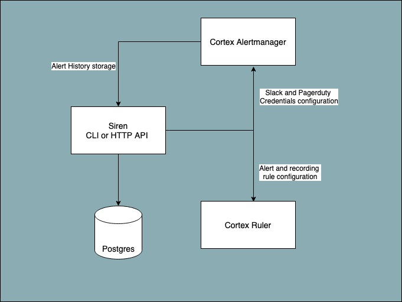

# Siren

Siren provides alerting on metrics of your applications using cortexmetrics in a simple DIY configuration. With Siren,
you can define templates(using go templates standard), and create/edit/enable/disable prometheus rules on demand. It
also gives flexibility to manage bulk of rules via YAML files. Siren can be integrated with any client such as CI/CD
pipelines, Self-Serve UI, microservices etc.



## Key Features

- **Rule Templates:** Siren provides a way to define templates over prometheus Rule, which can be resued to create
  multiple instances of same rule with configurable thresholds.
- **Multitenancy aware alerting:** Rules created with Siren are by defualt multi tenancy aware.
- **DIY Interface:** Siren can be used to easily create/edit prometheus rules. It also provides soft delete(disable)
  so that you can preserve thresholds in case you need to resue the same alert.
- **Managing bulk rules:** Siren enables users to manage bulk alerts using YAML files in specified format using simple
  CLI.
- **Alerting Credentials management:** Siren can store slack and pagerduty credentials, sync them with Cortex
  alertmanager to deliver alerts on proper channels, in a multitenant fashion. It gives a simple interface to rotate the
  credentials on demand via HTTP API.

To know more, follow the detailed [documentation](docs)

## Usage

Explore the following resources to get started with Siren:

* [Guides](docs/guides) provides guidance on usage.
* [Concepts](docs/concepts) describes all important Siren concepts including system architecture.
* [Reference](docs/reference) contains details about configurations and other aspects of Siren.
* [Contribute](docs/contribute/contribution.md) contains resources for anyone who wants to contribute to Siren.

## Running locally

Siren requires the following dependencies:

* Docker
* Golang (version 1.16 or above)
* Git

Run the application dependencies using Docker:

```
$ docker-compose up
```

Update the configs(db credentials etc.) as per your dev machine and docker configs.

Run the following commands to compile from source

```
$ git clone git@github.com:odpf/siren.git
$ cd siren
$ go build main.go
```

To run tests locally

```
$ make test
```

To run tests locally with coverage

```
$ make test-coverage
```

To run server locally

```
$ go run main.go serve
```

To view swagger docs of HTTP APIs visit `/documentation` route on the server.
e.g. [http://localhost:3000/documentation](http://localhost:3000/documentation)

## Contribute

Development of Siren happens in the open on GitHub, and we are grateful to the community for contributing bugfixes and
improvements. Read below to learn how you can take part in improving Siren.

Read our [contributing guide](docs/contribute/contribution.md) to learn about our development process, how to propose
bugfixes and improvements, and how to build and test your changes to Siren.

To help you get your feet wet and get you familiar with our contribution process, we have a list of
[good first issues](https://github.com/odpf/siren/labels/good%20first%20issue) that contain bugs which have a relatively
limited scope. This is a great place to get started.

## Credits

This project exists thanks to all the [contributors](https://github.com/odpf/siren/graphs/contributors).

## License

Siren is [Apache 2.0](LICENSE) licensed.
