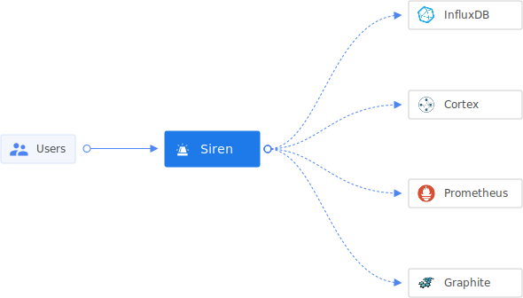

# Siren


[](LICENSE)
[](Version)
[](https://coveralls.io/github/odpf/siren?branch=main)

Siren provides alerting on metrics of your applications using [Cortex metrics](https://cortexmetrics.io/) in a simple
DIY configuration. With Siren, you can define templates(using go templates standard), and create/edit/enable/disable
prometheus rules on demand. It also gives flexibility to manage bulk of rules via YAML files. Siren can be integrated
with any client such as CI/CD pipelines, Self-Serve UI, microservices etc.

<p align="center"></p>

## Key Features

- **Rule Templates:** Siren provides a way to define templates over alerting rule which can be reused to create multiple instances of the same rule with configurable thresholds.
- **Subscriptions:** Siren can be used to subscribe to notifications (with desired matching conditions) via the channel of your choice.
- **Multi-tenancy:** Rules created with Siren are by default multi-tenancy aware.
- **DIY Interface:** Siren can be used to easily create/edit alerting rules. It also provides soft-delete (disable) so that you can preserve thresholds in case you need to reuse the same alert.
- **Managing bulk rules:** Siren enables users to manage bulk alerting rules using YAML files in specified format with simple CLI.
- **Receivers:** Siren can be used to send out notifications to several channels (slack, pagerduty, email etc).
- **Alert History:** Siren can store alerts triggered by monitoring & alerting provider e.g. Cortex Alertmanager, which can be used for audit purposes.
To know more, follow the detailed [documentation](docs)

## Usage

Explore the following resources to get started with Siren:

- [Guides](docs/guides/overview.md) provides guidance on usage.
- [Concepts](docs/concepts/overview.md) describes all important Siren concepts including system architecture.
- [Reference](docs/reference) contains the details about configurations and other aspects of Siren.
- [Contribute](docs/contribute/contribution.md) contains resources for anyone who wants to contribute to Siren.

## Run with Kubernetes

- Create a siren deployment using the helm chart available [here](https://github.com/odpf/charts/tree/main/stable/siren)

## Running locally

Siren requires the following dependencies:

- Docker
- Golang (version 1.16 or above)
- Git

Run the application dependencies using Docker:

```sh
$ docker-compose up
```

Update the configs(db credentials etc.) as per your dev machine and docker configs.

Run the following commands to compile from source

```sh
$ git clone git@github.com:odpf/siren.git
$ cd siren
$ go build main.go
```

## Running tests

```sh
# To run tests locally
$ make test

# To run tests locally with coverage
$ make test-coverage
```
## Generate Server Configuration

```sh
# To generate server configuration
$ go run main.go server init
```

This will generate a file `./config.yaml`.

## Running Server

```sh
# To run server locally
$ go run main.go server start
```

To view swagger docs of HTTP APIs visit `/documentation` route on the server.
e.g. [http://localhost:3000/documentation](http://localhost:3000/documentation)

## Contribute

Development of Siren happens in the open on GitHub, and we are grateful to the community for contributing bugfixes and
improvements. Read below to learn how you can take part in improving Siren.

Read our [contributing guide](docs/contribute/contribution.md) to learn about our development process, how to propose
bugfixes and improvements, and how to build and test your changes to Siren.

To help you get your feet wet and get you familiar with our contribution process, we have a list of
[good first issues](https://github.com/odpf/siren/labels/good%20first%20issue) that contain bugs which have a relatively
limited scope. This is a great place to get started.

This project exists thanks to all the [contributors](https://github.com/odpf/siren/graphs/contributors).

## License

Siren is [Apache 2.0](LICENSE) licensed.
