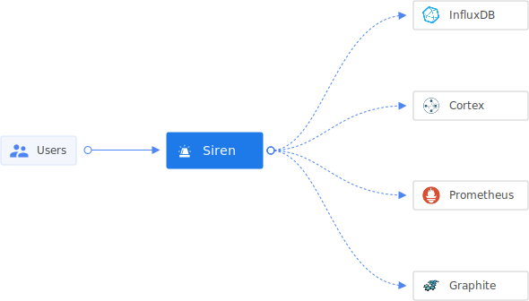

# Introduction

Siren provides alerting on metrics of your applications using cortexmetrics in a simple DIY configuration. With Siren,
you can define templates(using go templates standard), and create/edit/enable/disable prometheus rules on demand. It
also gives flexibility to manage bulk of rules via YAML files. Siren can be integrated with any client such as CI/CD
pipelines, Self-Serve UI, microservices etc.

## Key Features

- **Rule Templates:** Siren provides a way to define templates over prometheus Rule, which can be resued to create
  multiple instances of same rule with configurable thresholds.
- **Multitenancy aware alerting:** Rules created with Siren are by defualt multi tenancy aware.
- **DIY Interface:** Siren can be used to easily create/edit prometheus rules. It also provides soft delete(disable)
  so that you can preserve thresholds in case you need to resue the same alert.
- **Managing bulk rules:** Siren enables users to manage bulk alerts using YAML files in specified format using simple
  CLI.
- **Alerting Credentials management:** Siren can store slack and pagerduty credentials, sync them with Cortex
  alertmanager to deliver alerts on proper channels, in a multitenant fashion. It gives a simple interface to rotate the
  credentials on demand via HTTP API.

To know more, follow the detailed [documentation](docs)

## Usage

Explore the following resources to get started with Siren:

* [Guides](docs/guides) provides guidance on usage.
* [Concepts](docs/concepts) describes all important Siren concepts including system architecture.
* [Reference](docs/reference) contains details about configurations and other aspects of Siren.
* [Contribute](docs/contribute/contribution.md) contains resources for anyone who wants to contribute to Siren.
