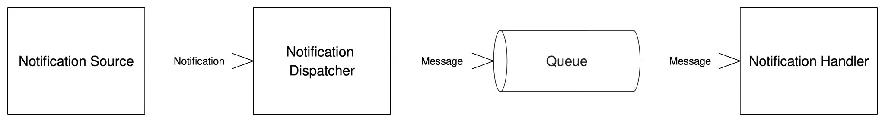

# Notification

Notification is one of main features in Siren. Siren capables to send notification to various receivers (Slack, PagerDuty). Notification in Siren could be sent directly to a receiver or user could subscribe notifications by providing key-value label matchers. For the latter, Siren routes notification to specific receivers by matching notification key-value labels with the provided label matchers.

Below is how the notification is implemented in Siren

**Notification Source** is a point where a notification is generated. In Siren, there are two points of notification source: `/receivers/{id}/send` API and alerts hook API. The first one will generate and publish notification when the API is invoked with some message in its payload and the latter one will always generate and publish notification everytime the hook API is called by the provider.

## Notification Message

Each receiver might expect different payload. User needs to pass notification message payload in the same format as what receiver (notification vendor) expected. All message payload contracts could be found under [receivers](../receivers/slack.md).

### Templating Notification Message Payload

Message payload in notification could also be reused by defining template and passing some variables needed. See [template](../guides/template.md) for further details on how to use the template feature.

### Notification Message State

There are several possible states of notification message when Siren tries to send it.

- `enqueued` means notification message has been just enqueued. This is a fresh notification message that is ready to be dequeued.
- `pending` means the notification message is dequeued and the process of sending notification is still on-going.
- `failed` means there is something wrong when Siren tried to send the notification. The `last error` and `number of attempt` are recorded in the message itself.
- `published` means the message has successfully been sent.

### Notification Message Expiry Duration

It is possible to set notification message to be expired after some duration. If the expiry duration is not set, this assumes the notification message has no expiration time.

## Queue

Queue is used as a buffer to avoid pressure when notifications are being sent. Siren implements Queue as a plugin. Currently there are two kind of queue plugin supported: in-memory (not for production usage) and postgres. User could choose the which queue to use by mentioning it in the [config](../reference/server_configuration.md).

### In-memory Queue

In-memory queue simulates a queue with Go channel. The usage is intended to be used in development only.

### PostgreSQL Queue

Siren uses Postgres `SKIP LOCK` feature to implement queues with postgres.

## Notification Handlers

Notification handler responsibles to dequeue message and send notification to the receivers. There are two kind of Notification Handler in Siren, the main notification handler and the notification dlq handler. Both could be configured in the [server configuration](../reference/server_configuration.md).

Notification handlers could be run in the same process inside server or could be run separately as a [worker](../guides/workers.md). It is also possible for the handlers to only process specific receiver types. This can be done by specifying supported `receiver_types` in the [config](../reference/server_configuration.md). One could also configure the notification to be dequeued in batch by specifying `batch_size > 1` in the config.

### Notification Message Handler

The notification message handler is a main handler that will dequeue the supported `receiver_type` with `batch_size` number messages that are not expired from the main queue and try sending each message to the desired receivers. 

If there is an error, main notification handler will clasify whether the error is retryable or not (e.g. if bad request, it is non-retryable), mark the message as `failed` and queue it to DLQ.

### Notification DLQ handler

The notification dlq handler will dequeue the supported `receiver_type` with `batch_size` number messages that are not expired and have `failed` status from the dlq and try sending each message to the desired receivers. If there is an error, dlq handler will clasify whether the error is retryable or not. Notification handler will re-pick up the `failed` messages that are retryable and has been retried less than or equal max tries config.
