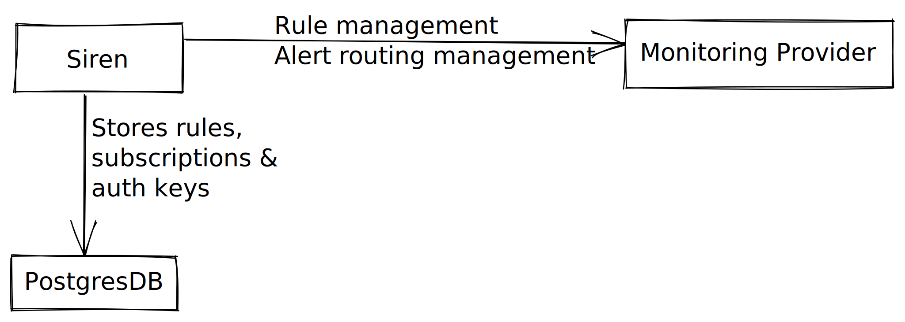
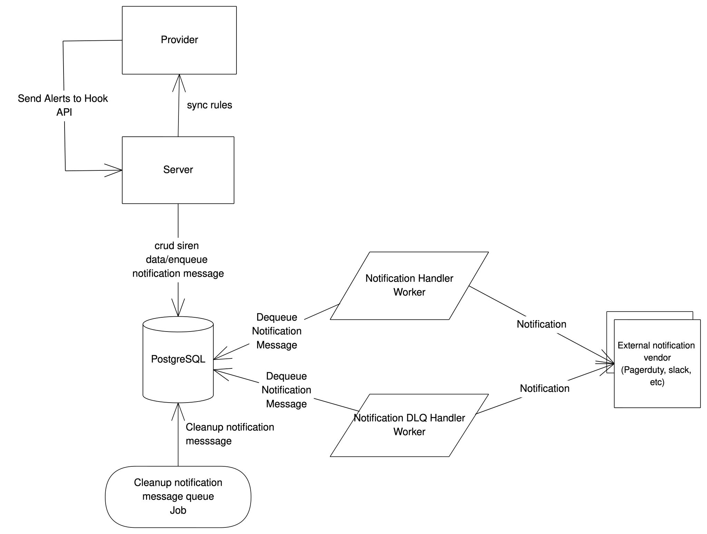

# Overview

The following contains all the details about architecture and other technical concepts of Siren.

Siren depends on monitoring and alerting provider for rule and alert creation. Sire also expects provider to send alerts to a Siren webhook API and Siren manages the notification routing and publication as well as storing the alerts history.

## Features

_**Alerting Rules**_

Siren capables to manage alerting rules for various monitoring providers.

_**Notification**_

Siren capables to subscribe to triggered alerts and send notifications. It also capable to send an on-demand notification.

_**GRPC and HTTP API**_

GRPC Server exposes RPC APIs and RESTful APIs (via GRPC gateway) to allow configuration of rules, templates, alerting credentials and storing triggered alert history.

_**CLI**_

Siren CLI provides easy to use commands to perform various actions. Currently, the actions supported are: starting Siren Server, creating/updating templates and rules via a specified YAML file, migrating database schema, start a notification handler worker, and run a notification-related job. Read more about usage [here](../guides/overview.md).

## Overall System Architecture

Let's have a look at the major components:

- **Provider:** is a service/platform that does monitoring, observability, and alerting (Cortex, Influx). Provider is expected to send alerts information to siren via siren's webhook API everytime alerts are triggered. Siren does alerting rules management and synchronize the rules with the provider.

- **Upstream Services:** are services that sends observability metrics (via telegraf, prometheus-exporter, open-telemetry) to a monitoring & alerting provider (Cortex, Influx). A provider will trigger an alert if the incoming metrics meet certain rules.

- **Notification Vendor:** is a service/platform that has capability to send notification (e.g. PagerDuty, Slack, etc). Siren has capability to store a specific notification vendor information and credentials, Siren calls it `receiver`. Siren ables to send notification to receivers.

### Siren Architecture

- **Server:** is a main component in Siren that exposes GRPC & HTTP API within the same port. Client interacts with Siren ecosystem through Server. Server talks to a provider e.g. Cortex and DB to configure alerting rules using stored templates and configure alertmanager per tenant with the stored credentials per team.

- **PostgreSQL:** is a main storage of Siren. Secret information is stored encrypted in the DB. [Notification](../guides/notification.md) in Siren requires a Queue and for current version Siren uses PostgreSQL as a queue. Siren maintains two schemas in the PostgreSQL, `public` and `notification`. Siren uses `public` schema as its main storage to store all data (e.g. templates, rules, receivers) except notification messages. Notification messages are stored in `notification` schema and handled as a queue in PostgreSQL.

- **Workers:** are another instances in Siren that run detached (although possibly to run within the server too) from the server. Notification handler and dlq handler are workers that run with short period to dequeue notification messages and publish the messages to the notification vendors (e.g. slack, PagerDuty, etc)

- **Job:** is a task in Siren that could be executed and stopped once the task is done. The Job is usually run as a CronJob to be executed on a specified time.

### Provider: Cortex

- **Cortex Ruler:** is a microservice of Cortex responsible to handle alerting rules. The configured rules are stored in Cortex Ruler. Siren Rules HTTP APIs call Cortex ruler to create/update/delete rule group in a particular namespace. You can create a [provider](../guides/provider_and_namespace.md) for that purpose and provide appropriate hostname.

- **Cortex Alertmanager:** is a microservice of Cortex responsible to handle alerting notification. Cortex sets up alert history webhook receiver to capture triggered alert history. Cortex Alertmanger hostname is fetched from [provider's](../guides/provider_and_namespace.md) host key.

