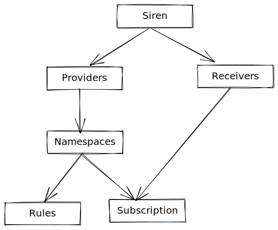

# Schema Design

Siren stores providers, namespaces, templates, rules and triggered alerts history, receivers and subscriptions in
PostgresDB.

We use GORM to handle database interactions and running migrations. GORM make it easier to create tables from Golang
Struct declaration.

There are the tables as of now as described below:

- **providers:** Stores the info of monitoring providers.

- **namespaces:** Stores the info of tenancy inside a monitoring provider

- **alerts:** Stores the triggered alert history.

- **templates:** Stores the templates uploaded via HTTP APIs.

- **rules:** Stores the rules configured and their state and thresholds defined.

- **receivers:** Stores the info of notification mediums e.g. Slack, HTTP Webhook, Pagerduty etc.

- **subscriptions:** Stores alert routing logic based on matching conditions

**Providers table:**

| Column      | Type                     | Description                                                        | Example                            |
|-------------|--------------------------|--------------------------------------------------------------------|------------------------------------|
| id          | bigint                   | Primary key                                                        | 1                                  |
| created_at  | timestamp with time zone | Creation timestamp                                                 | `2021-03-05 12:37:56.905618+05:30` |
| updated_at  | timestamp with time zone | Last update timestamp                                              | `2021-03-05 12:37:56.905618+05:30` |
| name        | text                     | name of the provider                                               | `localhost-cortex`                 |
| urn         | text                     | urn of the provider, should be unique                              | `localhost-cortex`                 |
| type        | text                     | Type of monitoring provider (cortex/influx etc)                    | `cortex`                           |
| labels      | jsonb                    | generic kv pair that can be used for searching for appropriate row | `{"org":"odpf"}`                   |
| credentials | jsonb                    | any configuration data for that provider e.g. auth                 | `{"bearer_token": "abcd"}`         |

**Namespace table:**

| Column      | Type                     | Description                                                        | Example                            |
|-------------|--------------------------|--------------------------------------------------------------------|------------------------------------|
| id          | bigint                   | Primary key                                                        | 1                                  |
| created_at  | timestamp with time zone | Creation timestamp                                                 | `2021-03-05 12:37:56.905618+05:30` |
| updated_at  | timestamp with time zone | Last update timestamp                                              | `2021-03-05 12:37:56.905618+05:30` |
| name        | text                     | name of the namespace                                              | `odpf`                             |
| urn         | text                     | urn of the namespace, should be unique within the provider         | `odpf`                             |
| labels      | jsonb                    | generic kv pair that can be used for searching for appropriate row | `{"org":"odpf"}`                   |
| credentials | jsonb                    | any configuration data for that namespace e.g. auth                | `{"bearer_token": "abcd"}`         |
| provider_id | int                      | foreign key of provider to which this namespace belongs            | 4                                  |

**Templates table:**

| Column     | Type                     | Description                                                                                          | Example                                                                                |
| ---------- | ------------------------ | ---------------------------------------------------------------------------------------------------- | -------------------------------------------------------------------------------------- |
| id         | bigint                   | Primary key                                                                                          | 1                                                                                      |
| created_at | timestamp with time zone | Creation timestamp                                                                                   | `2021-03-05 12:37:56.905618+05:30`                                                     |
| updated_at | timestamp with time zone | Last update timestamp                                                                                | `2021-03-05 12:37:56.905618+05:30`                                                     |
| name       | text                     | name of the template, should be unique                                                               | `cpuHigh`                                                                              |
| tags       | text[]                   | Tags array represented which resource types can use this template                                    | `{kafka, airflow}`                                                                     |
| body       | text                     | Alert or recording rule body                                                                         | See examples body in [here](../guides/templates.md)                                    |
| variables  | jsonb                    | JSON variable listing all variables in the body with their data type, description and default value. | `[{"name": "for", "type": "string", "default": "bar", "description": "group period"}]` |

**Rules Table:**

Rules belong to a provider namespace, identified using an optional namespace, optional group_name and mandatory template
and variables and status.

| Column            | Type                     | Description                                                                                                                                                                                     | Example                                                   |
|-------------------|--------------------------|-------------------------------------------------------------------------------------------------------------------------------------------------------------------------------------------------|-----------------------------------------------------------|
| id                | bigint                   | Primary key                                                                                                                                                                                     | 1                                                         |
| created_at        | timestamp with time zone | Creation timestamp                                                                                                                                                                              | `2021-03-05 12:37:56.905618+05:30`                        |
| updated_at        | timestamp with time zone | Last update timestamp                                                                                                                                                                           | `2021-03-05 12:37:56.905618+05:30`                        |
| namespace         | text                     | the [ruler namespace](https://cortexmetrics.io/docs/api/#get-rule-groups-by-namespace) in which this rule should be created(optional key for providers which doesn't have a need for namespace) | `kafka`                                                   |
| group_name        | text                     | the ruler group in which this rule should be created, optional key for provider where doesn't apply                                                                                             | `testGroup`                                               |
| providerNamespace | int                      | foreign key of namespace in which rule should be created                                                                                                                                        | 4                                                         |
| enabled           | bool                     | running status of alert (true or false)                                                                                                                                                         | `true`                                                    |
| template          | text                     | the template which should be used for rule body                                                                                                                                                 | `CPUHigh`                                                 |
| name              | text                     | name of the rule, must be unique, constructed as per `siren_api_providerURN_namespaceURN_namespace_groupName_template`                                                                          | `siren_api_localhost-cortex_odpf_kafka_testGroup_cpuHigh` |

**Alerts table:**

| Column        | Type                     | Description                                            | Example                            |
|---------------|--------------------------|--------------------------------------------------------|------------------------------------|
| id            | bigint                   | Primary key                                            | 1                                  |
| triggerd_at   | timestamp with time zone | Triggered timestamp                                    | `2021-03-05 12:37:56.905618+05:30` |
| updated_at    | timestamp with time zone | Last update timestamp                                  | `2021-03-05 12:37:56.905618+05:30` |
| created_at    | timestamp with time zone | Creation timestamp                                     | `2021-03-05 12:37:56.905618+05:30` |
| resource_name | text                     | resource on which the alert was triggered              | `kafkaMachine1`                    |
| rule          | text                     | name of template which used for this rule              | `cpuHigh`                          |
| metric_name   | text                     | the metric on which alert was triggered                | `cpu usgae %`                      |
| metric_value  | text                     | value of above metric on which the alert was triggered | `95%`                              |
| severity      | text                     | severity level of alert (CRITICAL, WARNING, RESOLVED)  | `CRITICAL`                         |

**Receivers:**

| Column        | Type                     | Description                                                        | Example                                  |
|---------------|--------------------------|--------------------------------------------------------------------|------------------------------------------|
| id            | bigint                   | Primary key                                                        | 1                                        |
| created_at    | timestamp with time zone | Creation timestamp                                                 | `2021-03-05 12:37:56.905618+05:30`       |
| updated_at    | timestamp with time zone | Last update timestamp                                              | `2021-03-05 12:37:56.905618+05:30`       |
| name          | text                     | Name of receiver                                                   | `siren-devs-slack-receivers`             |
| type          | text                     | Type of receivers (Slack/HTTP/Pagerduty)                           | `slack`                                  |
| labels        | jsonb                    | generic kv pair that can be used for searching for appropriate row | `{"team":"siren-devs"}`                  |
| configuration | jsonb                    | configuration data for that receiver(depends on the type)          | `{"token": "abcd", "workspace": "Odpf"}` |

**Subscriptions**

| Column       | Type                     | Description                                                                                             | Example                                                              |
|--------------|--------------------------|---------------------------------------------------------------------------------------------------------|----------------------------------------------------------------------|
| id           | bigint                   | Primary key                                                                                             | 1                                                                    |
| created_at   | timestamp with time zone | Creation timestamp                                                                                      | `2021-03-05 12:37:56.905618+05:30`                                   |
| updated_at   | timestamp with time zone | Last update timestamp                                                                                   | `2021-03-05 12:37:56.905618+05:30`                                   |
| urn          | text                     | URN of subscription                                                                                     | `siren-devs-slack-subscription`                                      |
| receiver     | jsonb                    | list of receivers which will be picked for notification                                                 | `[{"id":1, "configuration":{"channel_name":"siren-devs-critical"}}]` |
| match        | jsonb                    | generic kv pair that must hold true in the alert for notification to be sent via the receives described | `{"token": "abcd", "workspace": "Odpf"}`                             |
| namespace_id | int                      | foreign key of namespace to which this belongs to                                                       | 10                                                                   |
